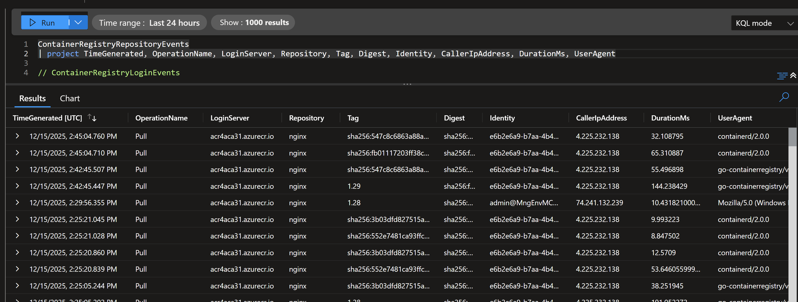
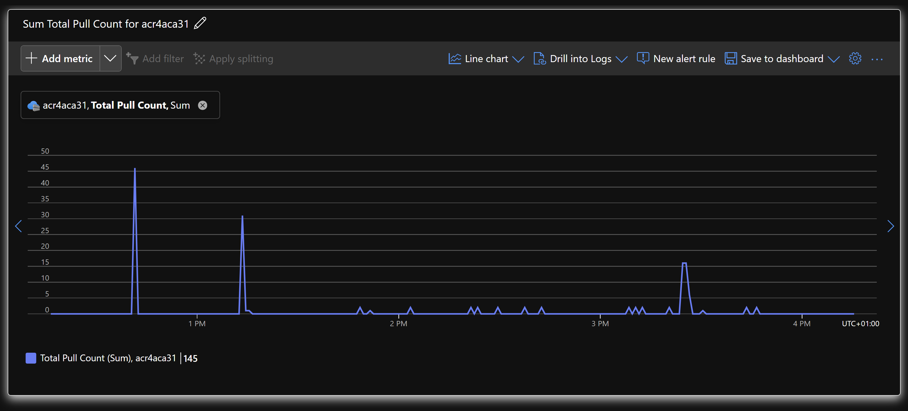

# Monitoring Azure Container Registry Pulls with Azure Monitor

This demonstration shows how to:

1) Deploy `Azure Container Apps` that pull container images from a private `Azure Container Registry`.
2) Monitor `Azure Container Registry` image pulls using `Azure Monitor`.
3) View logs and metrics for image pull activity.

