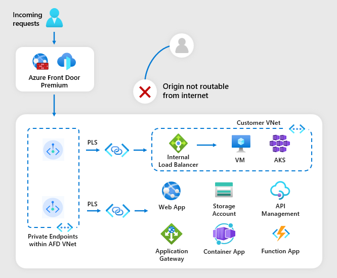
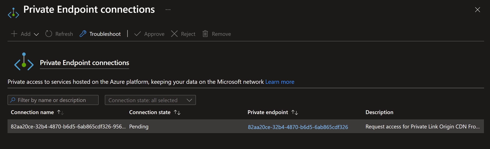

# Exposing private Container Apps via Azure Front Door

You zill learn how to connect directly from Azure Front Door to your Azure Container Apps using a private link instead of the public internet. In this tutorial, you create an Azure Container Apps workload profiles environment, an Azure Front Door, and connect them securely through a private link. You then verify the connectivity between your container app and the Azure Front Door.



src: https://learn.microsoft.com/en-us/azure/container-apps/how-to-integrate-with-azure-front-door?pivots=azure-portal

Deploy the sample using Terraform:

```sh
terraform init
terraform apply -auto-approve
```

After deploying the resources using Terraform, you will need to approve the private endpoint connection request in the Azure Portal.



Now you can access your Container App through the Azure Front Door endpoint. You can find the Front Door endpoint URL in the Terraform output or in the Azure Portal under the CDN Front Door endpoint resource. It should look like this: YOUR_AFD_ID.azurefd.net

## Clean up resources

When no longer needed, you can delete the resources created by Terraform by running:

```sh
terraform destroy -auto-approve
```
